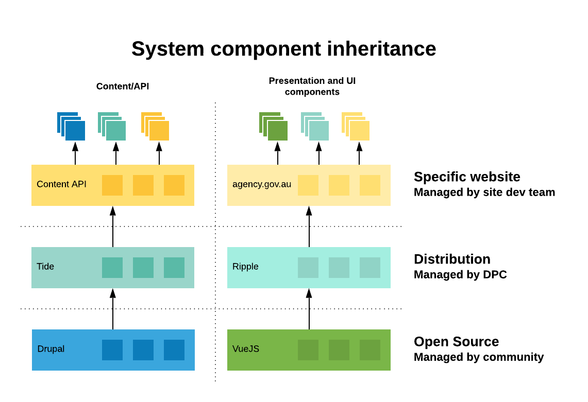

# Architecture

Single Digital Presence is a distribution that consists of Content Repository
with exposed API (headless [Drupal](https://www.drupal.org) distribution called
**[Tide](../tide)**) and a front-end components library ([Vue.js](https://vuejs
.org/) with [Nuxt](https://nuxtjs.org/) server rendering framework called 
**[Ripple](../ripple)**) hosted on the latest generation hosting platform 
([Kubernetes](https://kubernetes.io/)-based [Docker](https://www.docker.com/)
container platform called **[Bay](../bay)**). 

## Application system components

At the application layer, there are 2 main components of the system:

- **[Tide](../tide)** - Drupal 8 headless distribution that serves as a content 
  repository.
- **[Ripple](../ripple)** - Vue.js-based library of front-end components. Each 
  instance of Ripple serves as a standalone front-end application for a website.

!!! note

    The two main requirements that have significant affect on the architecture
    were: 
    
    - Content sharing across multiple sites.
    
    - Content syndication via API.
      
    [Content Sharing](#content-sharing) is a common issue amongst larger
    organisation, however the solutions are highly complex and the publicly
    available options are not mature enough for immediate use.

## System components inheritance

There are 3 layer of components in the Distribution. The features provided by
every layer contribute to a final particular website feature set.

Each of the layers is owned, supported and maintained by a distinct community: 
- Open Source - provides Drupal core and contributed modules. It is maintained
  by a worldwide Drupal community.
- Distribution - provides content types, multi-channel and API features. It is 
  maintained by SDP development team. 
- Specific website - provides unique site features and design components. It is
  maintained by a particular website development team.

See [Tide](../tide) and [Ripple](../ripple) for more information about architecture.

## Content Sharing

Content Editors author content and select content sharing targets
(Frontend Websites and site sections) for each content piece. Drupal will
then serve this content as data through API to each Frontend Website,
implemented as a separate front-end application.

Content Repository site has only a basic frontend and its IP restricted to a
list of allowed IP addresses, so that content editors from designated offices
could access the editorial interface.

The API endpoints for the Content Repository site are accessible to the world
over the same predefined domain (e.g., https://api.agency.gov.au). There is no
authentication for content consumers.

All content editing for all sites is performed through the central content
repository instance (e.g. https://content.agency.gov.au).

There are no restrictions for editing content between the various sites,
allowing content editors to be used across sites to better utilise limited
resources.

Content Approvals are still restricted to ensure content is only published upon
approval by relevant users. This ensures cross site changes do not go public
without proper approval. All content changes are tracked, so users making
changes to the wrong site can receive further training to prevent future
mistakes.
