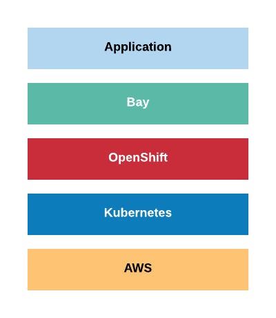
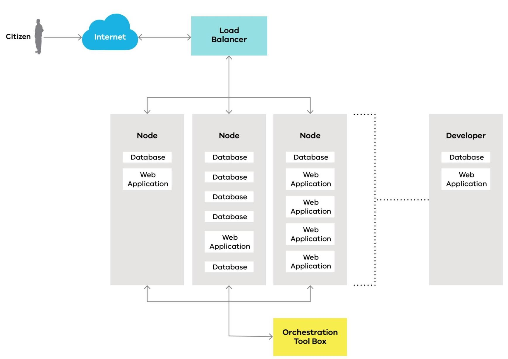

# Bay

Bay is a fully managed platform and hosting environment that provides an open
Platform as a Service model managed by SDP. It is an open-source hosting platform based on [Lagoon](https://github.com/amazeeio/lagoon) which allows agencies to build, test and deliver websites via the cloud.

Bay is a Kubernetes-based (OpenShift) Docker container hosting platform with
auto-scaling, auto-recovery and high-availability at core.

Bay is based on open-source project [Lagoon](https://github.com/amazeeio/lagoon).

!!! quote

    Lagoon solves what developers are dreaming about: A system that allows
    developers to locally develop their code and their services with Docker and
    run the exact same system in production. The same Docker images, the same
    service configurations and the same code.

The platform has several layers (from the bottom to the top):

{: style="width:300px;"}

The AWS layer is how the platform is physically hosted. It is spread accross 
multiple data centers to allow auto-scaling, fault-tolerance and disaster 
recovery.

The Kubernetes layer allows to automate deployment, scale, and manage 
containerized application.

The OpenShift layer is a Kubernetes distribution with enterprise-grade 
features and support.

The Bay layer is an orchestration tool used to bundle containers into projects
and manage deployments.

The Application layer is where Drupal, NodeJS and other types of application 
reside.  

## Architecture overview  

An over-simplified Bay platform architecture overview:

Requests coming from the Citizen to the load balancer and then get directed 
to the dedicated containers in specific data centre (not necessarily the same
for all containers). These containers are provisioned, auto-scaled and 
auto-healed using Orchestration Tool Box.

Developers have identical development stack installed locally.

Automated builds in Continuous Integration servers use identical container 
images.

In this way, all environments are running identical versions of 
languages, frameworks and libraries required for a particular website.   

## Namespaces
- Docker vendor namespace: `dpc_sdp`
- Docker images namespace: `*` (service name)

## Repositories
- Bay source code: https://github.com/dpc-sdp/bay
- Quay: https://quay.io/organization/dpc_sdp
