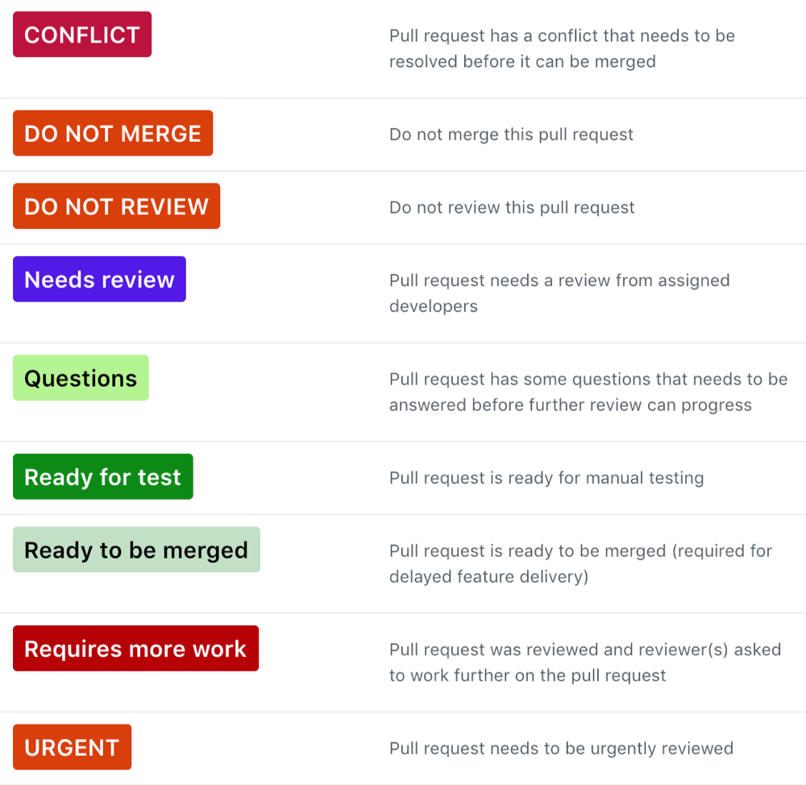

# Code review

Code review is a vital for effective and efficient collaboration of successful
teams.

## Purpose
- Promote shared understanding of the codebase. Getting other people to look at 
  code changes improves visibility and understanding of the way in which code 
  works. It therefore helps protect against the loss of knowledge and 
  productivity that can occur as developers come and go.
- Provide a different perspective on solutions. Coming with a fresh perspective
  and different experiences, the reviewer of code may think of possibilities 
  that did not occur to the original developer.
- Improved code quality. The reviewer may notice issues with scalability, typos
  or other issues that might have slipped by the developer, but which may not
  cause errors or warnings visible to the end user.

## Questions to ask when reviewing code
- Is there enough commenting (or too much)?
- Is the code readable? Are the names of variables, functions, methods and 
  classes clear and unambiguous?
- Are functions and class methods broken down to each fulfill one discrete 
  requirement?
- Have unit tests been written?
- Has documentation been written/updated? Do comments in the code point to it 
  and vice versa?
- Is an upgrade script needed? If so, does it run to completion and without 
  an error?
- Are assumptions being made about the way the site will be used that might not   
  be valid? For example, hard-coding `http://` or `https://` in URLs instead of 
  check what protocol was used for the request and/or making the URL ambivalent 
  (start with `//`).
- Is code secure or does it avoid creating new vulnerabilities implementations 
  for an existing functionality?

## Preparing code for code review
- Provide clear description about *what*, *why* and *how* the code has been changed.
- Provide screenshots, if applicable.
- Read your own code changes and add comments to parts that may raise questions.
- Provide a link to the issue tracker.
- Assign relevant developers to review the pull request.
- Assign yourself as an owner of the pull request.
- Add *Needs review* label to the pull request.  

Read more about [Mindful Communication in Code
Reviews](../assets/mindful-communication-in-code-reviews.pdf).

## Labels
Using labels on GitHub can help organise pull requests and issues. Here are the 
labels that describe the most of the states of pull request.

{: style="width:500px;"}

An example of the pull request progression through labels:

`DO NOT REVIEW` -> `Needs review` -> `Ready for test` -> `Ready to be merged`
 

[Github Labels](https://github.com/integratedexperts/github-labels) script
can automatically create above labels in your projects.
