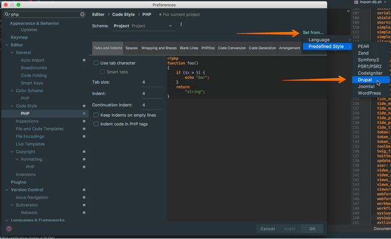

# Coding Standards

We use Drupal [Coding Standards](http://drupal.org/coding-standards) for all our
[contributed](../../tide/modules.md) and custom modules.

[PHPCodeSniffer](https://github.com/squizlabs/PHP_CodeSniffer) runs our code
linting using rules from [Drupal Coder](https://www.drupal.org/project/coder)
module and additional customizations. See our the PHPCodeSniffer [configuration
file](https://github.com/dpc-sdp/dev-tools/blob/master/phpcs.xml).

Run all coding standards checks:
```console
ahoy lint
```

Note that these checks run during [automated builds](automated-builds.md).

## Composer
- Alphabetise package order where possible<br/>
  This helps developers to visually scan code faster.
- Include information to make reviews easier<br/>
  Each patch attribute name should contain the title of the Drupal.org (d.o) issue, 
  the link to the issue comment that contains the patch and the patch attribute 
  value should be the patch file on drupal.org:  
  ```json
  "drupal/project": {
          "Issue title - https://www.drupal.org/node/1234567#12345678": "https://www.drupal.org/files/issues/issue_title-1234567-2.patch"
  },
  ```
  Following this approach makes it simpler to follow up the status of patches during updates.  
    Example of a properly formatted patches attribute:
  ```json
  "patches": {
        "drupal/better_exposed_filters": {
          "Add core/drupal as dependency to better_exposed_filters asset libraries - https://www.drupal.org/node/2902742": "https://www.drupal.org/files/issues/add_core_drupal_as-2902742-2.patch"
        },
        "drupal/core": {
          "No validation on text length for menu description when editing node - https://www.drupal.org/node/2852665#comment-12157856": "https://www.drupal.org/files/issues/fatal_error_remove_menu_add_with_tests-2852665-12.patch"
        },
  },
  ```

## Setting project coding standards inspections in PHPStorm

1. *PHPStorm* > *Preferences* > *Code Style*
2. Select the appropriate language (in the example image below it is `PHP`)
3. Select the *Set from...* link
4. Select *Predefined Style* > *Drupal*

It is then possible to use the keyboard shortcut <kbd>Alt</kbd> + 
<kbd>command</kbd> + <kbd>l</kbd> to format a file or selection.


