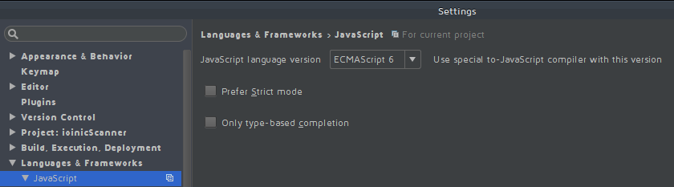
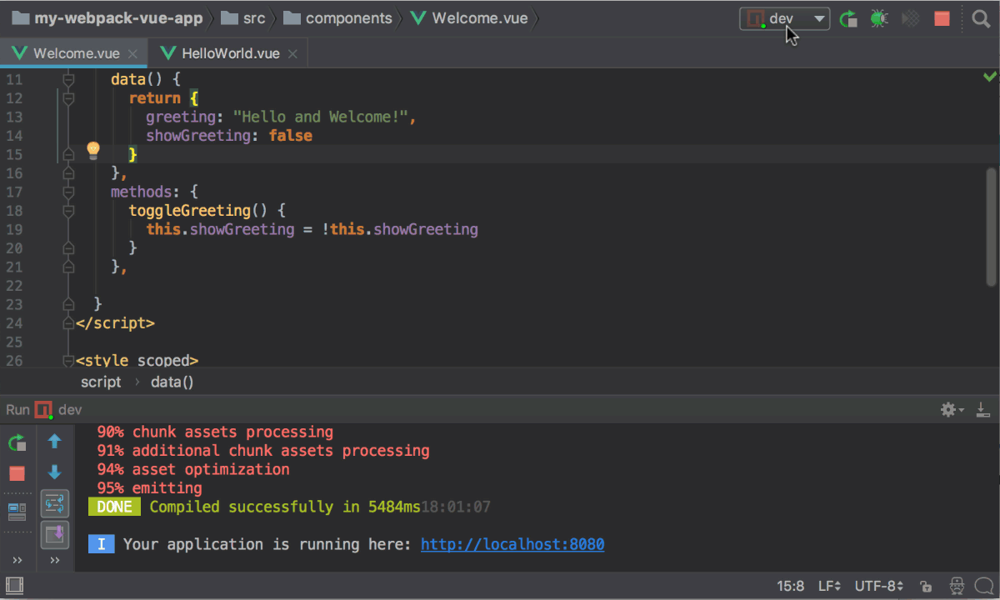

# Local development environment
## Prerequisites

Your development environment will need to have latest version of the following installed:

- Node (Version 14.0.0 or higher)
- Yarn (Version 1.2.0 or higher) Or
- NPM (Version 6.0.0 or higher) 
- Git

### IDE

We recommend using Visual Studio Code or Webstorm. 

#### Visual Studio Code

There are some recommended plugins if using Visual Studio Code:

- Vetur
- Eslint

#### Webstorm

##### Setup JS version 
1. Install Vue.js plugin (follow the setup guide at  https://www.jetbrains.com/help/phpstorm/vue-js.html)
2. Set "JavaScript language version" to "ECMAScript 6" 

##### Setup JS Debugging
1. Create a new JavaScript debug configuration
2. Specify the URL the app is running on (http://localhost:8000)
3. Set a breakpoint 
4. Start the debug session by pressing "Debug" button in WebStorm/PHPStorm.

Once the code where the breakpoint is has been triggered, the execution will
stop, and you’ll see the local and global variables, the call stack, and many
other things in the IDE debug tools window.

### Terminal

We recommend using the integrated terminal in Visual Studio or Webstorm or another *nix based terminal. If on Windows, we recommend using Windows Subsystem for Linux to run bash or zsh terminal. 
