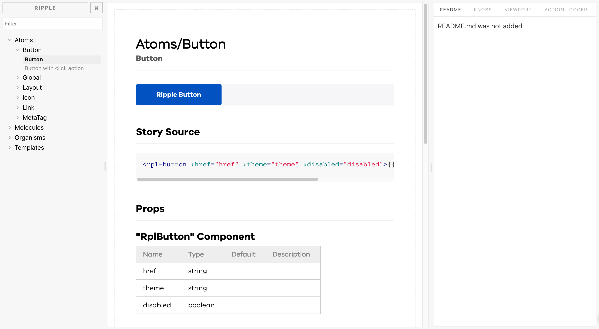

# Style guide 

!!! todo "This content is out of date"

## Developing custom component

A style guide is a document that provides guidelines for the way your brand should
be presented from both a graphic and language perspective. The purpose of a
style guide is to make sure that multiple contributors create in a clear and
cohesive way that reflects the corporate style and ensures brand consistency
with everything from design to writing.

Ripple Component Library uses [Storybook](https://storybook.js.org/) open-source
software for a "living" style guide: any changes to the components in code 
are reflected within Storybook. 

!!! example "Example of style guide"
   
    Example of the style guide take from [Ripple Component library](https://ripple.sdp.vic.gov.au)
  
    

## Setup

Frontend Websites can add Storybook configuration and publish it as GitHub pages
using automated builds.

See official setup guide https://storybook.js.org/docs/guides/guide-vue/

Components can be organised as required (Ripple uses atomic design) - Storybook
supports flexible configuration. See
https://github.com/dpc-sdp/ripple/tree/master/.storybook

The components can also be customised to be displayed in groups etc. See
https://github.com/dpc-sdp/ripple/tree/master/src/storybook-components

The demo data to use in Storybook components can be provided in a separate file.
See
https://github.com/dpc-sdp/ripple/blob/master/src/storybook-components/_data/demoData.js
 
