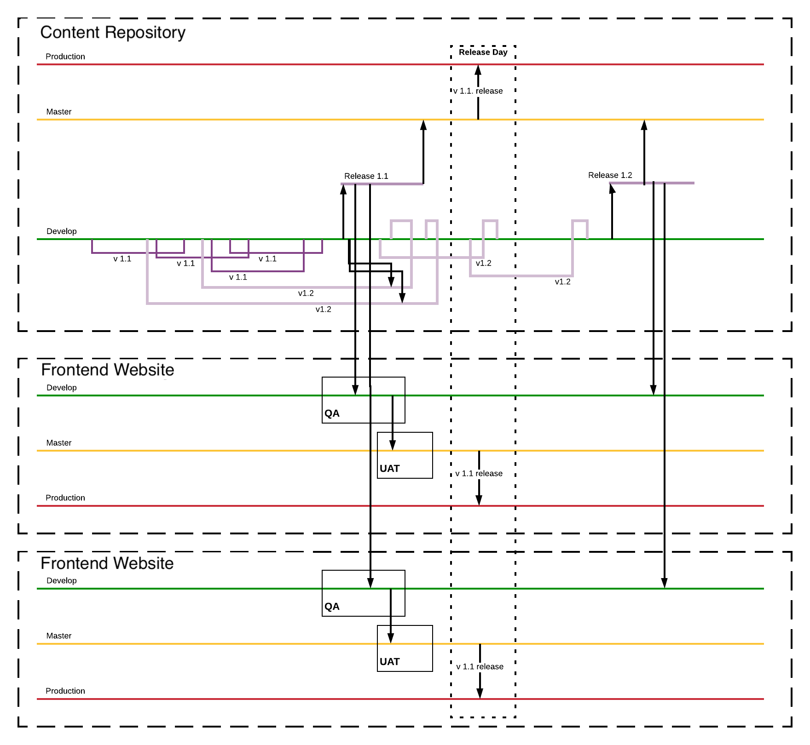

# Managing releases

The purpose of this document is to describe the git management process across
the Content Repository and Frontend Websites. 

!!! note
  
    For release management of Tide modules, please see [Versions](../../tide/modules/#versions)

## Issues
Changes to the Drupal API can have an effect on the Front end website due to
field and entity changes. This can lead to issues on Frontend Websites if
they are not updated at the same time as the Content Repository as they rely on
a common API. This can cause a delay in deploying Content Repository while
changes are merged to the Frontend Websites and go through QA and UAT.

## Versions
Both Content Repository and Frontend Websites release versions should follow [semantic versioning](https://semver.org/).

!!! quote
    
    Given a version number `MAJOR.MINOR.PATCH`, increment the: 
    `MAJOR` version when you make incompatible API changes, 
    `MINOR` version when you add functionality in a backwards-compatible 
    manner, and 
    `PATCH` version when you make backwards-compatible bug fixes. 
    
    Additional labels for pre-release and build metadata are available as 
    extensions to the `MAJOR.MINOR.PATCH` format.

## Git workflow
 
??? "Git branch schema for releases"
  
    Note that on this diagram `production` branch only receives release commits 
    (commits tagged with release versions). Such setup is used in hosting 
    that is deploying code for branches rather then for tags. If your hosting 
    provider supports deploying tags, the `production` branch may be replaced 
    with *switching a tag on production environment*.
    
     

Feature branches for both Content Repository and Frontend Websites start from 
the the `develop` branch. Frontend Websites may connect to the feature 
branch environments of the Content Repository to test front-end and back-end 
changes together. Once ready, the feature branches are merged back as pull 
requests against `develop` branch. 

Release branch for Content Repository starts from the `develop` branch. It stays
unmerged until Frontend Websites validate (through QA process) that newly 
introduced changes to Content Repository do not break Frontend Websites'
functionality.  

Once Frontend Websites confirm that release for Content Repository is stable, 
the release branch get's merged into `master`. At this point, both Content 
Repository and all Frontend Websites need to coordinate release time frame. 

Once ready to release, new release tags created in all projects and are deployed 
to production environments. 

## Releasing

!!! note
    
    In the steps below, it is assumed that both Content Repository and Frontend
    Websites have changes to result in release. If Frontend Websites do not have
    any new feature changes, they need to release only in case if Content 
    Repository API changes.
    
!!! note
    
    The steps below do not include any release communication steps. Always 
    prepare release plan with communication details, templates and rollback
    actions ahead of release, or, better, create a standardise release run sheet.

??? "Create and download a backup of the production database

    1. Log in to the Lagoon UI service
    2. Navigate to the project
    3. Select the `production` branch
    4. Select tasks from the menu
    5. Add a database backup task
       1. Select "Generate database backup [drush sql-dump]" from the drop-down
    6. When the task has completed you can download the archive by selecting the task item.

1. Create a release branch from `develop` in Content Repository
2. Create a release branch for each Frontend Website repository and push the
   changes as a new pull request against `develop` for each repository.
3. Have the QA team test the latest changes and perform a spot regression check
   in both Content Repository and all Frontend Websites.
4. Merge the Content Repository release branch to `master`
5. Once all Frontend Websites pass QA (or only minor bugs are found that will not
   effect release), merge the release branch on each Frontend Website to `develop` 
   and follow the standard release process through to `master`. 
6. Request UAT on all Frontend Websites. Once UAT is complete or 3 business days 
   are passed, prepare to tag and release to production.
7. Tag and deploy Content Repository release to production.
8. Tag and deploy each Frontend Website release to production.

## Deployment rollback plan

!!! note

    This process highlights the importance of release tags.

!!! danger

    This process should only be followed in the event of a failed deployment that is 
    impacting a sites uptime.

    This is a last resort and only to be used for expendiency.
    
    It is a destructive process and will require commiting directly 
    to the production branch.

??? "Synchronise the database archive with the production instance.

    The database archive should exist from the earlier release preparations.

    This step is required before any further code changes are pushed because they will trigger
    database updates. Although none should run this is a safety measure to ensure the codebase 
    will successfully deploy.

    The database archive should exist from the earlier release preparations.
    
    Drush is the simplest way to synchronise a database.

??? "Reset the branch to the last release"

   1. Ensure you have all the latest branch and tags
      `git fetch --all --tags`
   2. Checkout the `production` branch.
      `git checkout production`
   3. Identify the previous and reset the branch to this commit.
       `git reset --hard {tag}
   4. Force push - adminstrator access to the repository is required 
      `git push -f`
