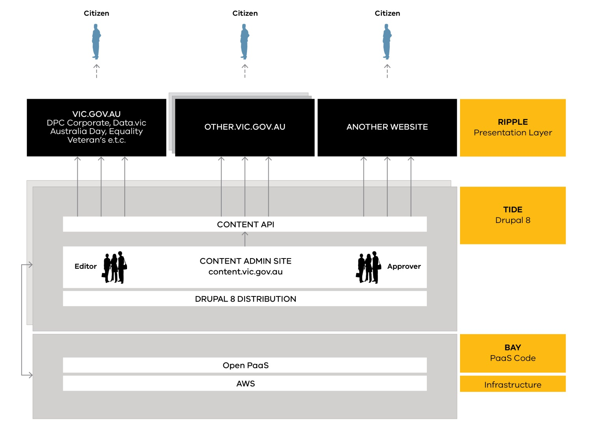

# Overview

SDP project covers implementing a Drupal distribution to build a content 
repository containing site sections and providing content for frontend websites. 
It also provides of technical implementation to build fully independent 
sites.

!!! info

    Example of content repository is https://vic.gov.au, which has site-sections 
    such as Aboriginal Victoria or Family Violence.
    
    Semi-independent sites are the other sites that have their content centrally 
    managed. An example of such a site is the Office of the Victorian Government 
    Architect site.
    
    Fully independent sites are completely separate installations of the whole 
    distribution.
        
    
  
## Project goals

- Make it easier to find, understand and use Victorian Government information 
- Consolidate 50 DPC websites onto one platform and provide a consistent user experience (UX), as a test case for whole of government application
- Simplify and standardise publishing
- Provide evidence base for a user first approach
- Reduce costs
- Increase security

## Benefits

- More consistent UX
- Improved admin interface
- Improved security and continuous improvement process
- Cheaper, more scalable and performant hosting
- Cost savings across government
- Collaboration between Government and developer community 
- Better developer experience
