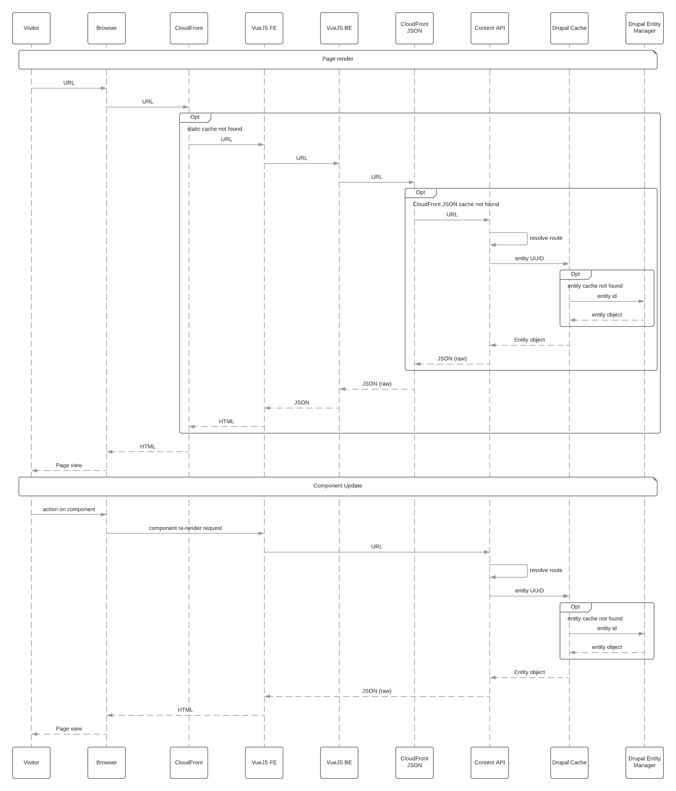
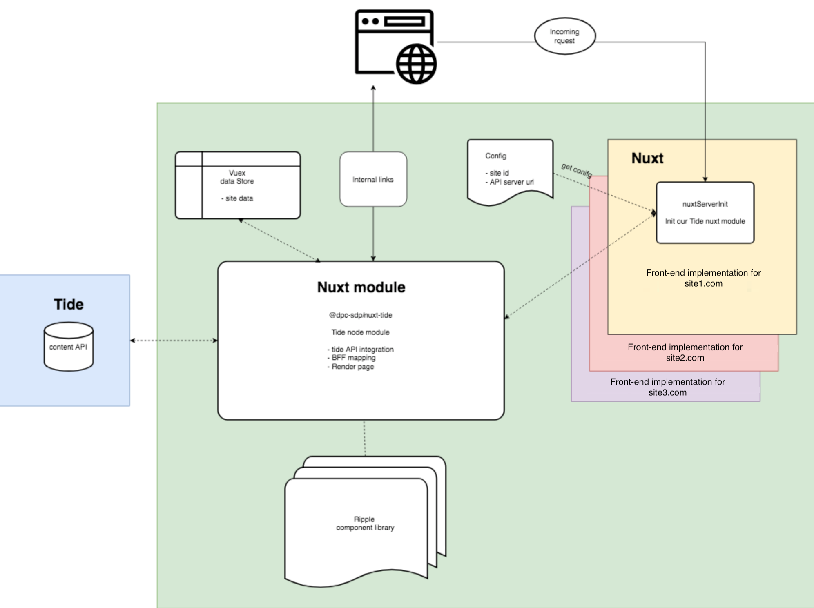

# Content data flow

This chapter describes how data requested from Content Repository flows to 
front-end website implementation and how it is then rendered to the visitor 
in the browser.

## Request round trip 
The diagram below shows how a visitor's request travels through all systems
to render a page and, subsequently, update a component.

??? "Component request diagram"

    

There are multiple caching layers to speed up the initial page render:
- Static HTML page cache in CloudFront 
  Cache of the previously rendered front-end page. This completely avoids
  requests to API, making the site render solely in the browser.
- Static API JSON response cache in CloudFront 
  Cache of the previously requested API response. This allows to speedup page
  assembly from several API endpoints.
- Content Repository entity cache and other caches 
  Internal caching mechanism within Content Repository. Allows to lower load
  and minimise expensive data retrieval operations from the database.   
  
Once rendered, components may request an update for a part of the page, 
bypassing all static cache layers, but still re-using caching within Content
repository.

Note that Content Repository refreshes internal caches and notifies external
proxies (CloudFront etc.) once the content changes. This mechanism is inbuilt 
in Drupal.

# Nuxt data processing

Once request reaches front-end website, Nuxt receives a request, fetches 
internal configuration and requests content from Content Repository via `tide` 
package, which has field mappings and other integrations defined. Once the 
content is received, the page template assembles page using Ripple component 
library, after which the page is sent to the browser.

Note that Ripple is completely separate from the `tide` package and Nuxt 
configuration - this makes it unbound to Tide Content Repository. 

