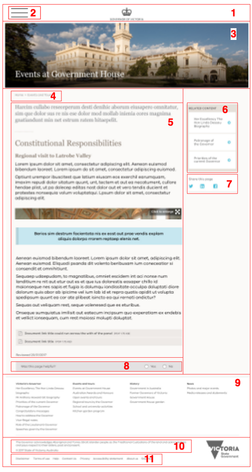
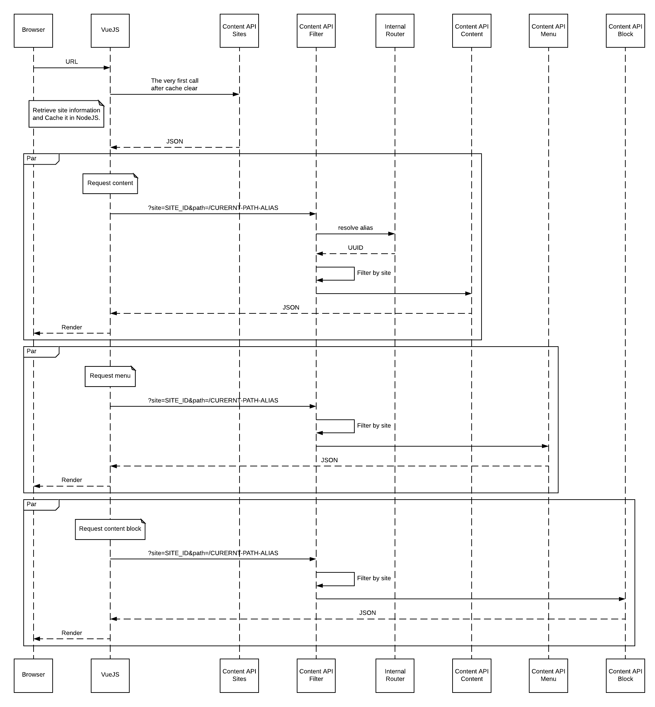
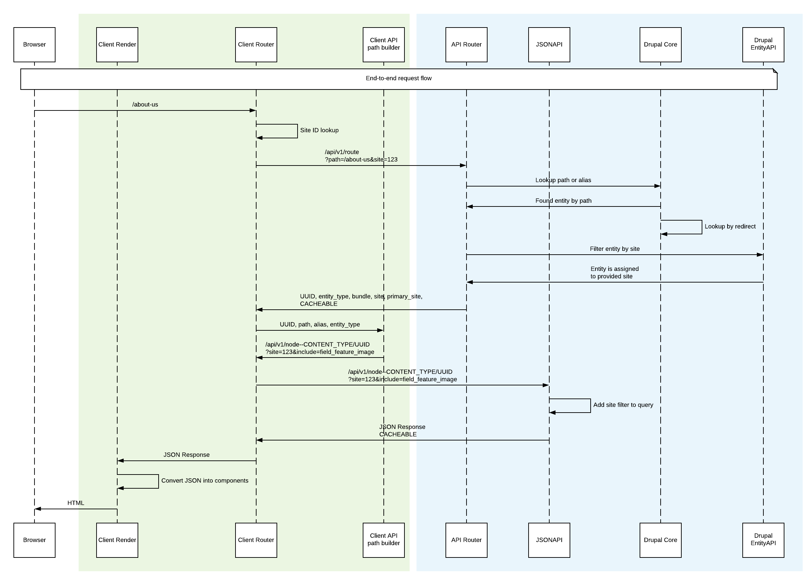

# Tide API

Content API is built from a set of contributed modules and custom code provided
through [Tide API](https://github.com/dpc-sdp/tide_api) module.

## Why JSONAPI?

Why we selected [JSONAPI standard](http://jsonapi.org/) over generic REST 
provided by Drupal core:
 
  - JSON is a standard of REST, a subset of generic REST rules. 
  - JSONAPI allows to query individual items and collections. 
  Drupal JSONAPI module automatically exposes entities as endpoints. Because 
  most of functionality is implement as entities in Drupal 8, there is no 
  need for custom code to expose required features. 
  - JSONAPI is a newer format
  - JSONAPI will be included in Drupal core.
  Documentation on using Drupal JSONAPI module: https://www.drupal
  .org/docs/8/modules/json-api 
  
  It is assumed that API consumers support the following:
  
  - Can traverse data.
  - Can cache based on response headers. 
  - Can resolve relationships by following links. 
  
## Drupal JSONAPI and related modules 
[jsonapi](https://www.drupal.org/project/jsonapi) - main module that exposes 
entities as endpoints and provides support for REST operations. 

[jsonapi_extras](https://www.drupal.org/project/jsonapi_extras) - helper module to alter
JSONAPI config: endpoints prefix (we are using `/api/v1`) and enable/disable
endpoints for automatically exposed entities (we use this to limit access to
internal entities). 
  
## Endpoints example

While providing a list of all endpoints would be to publish whole Drupal API 
(which is neither maintainable no required), the example page below demonstrates
how Frontend Website can be mapped to Content Repository endpoints.

||Component|Content API endpoint|Comment|
|--- |--- |--- |--- |
|1|route                  |`/api/v1/route?alias=<alias>`| Given an alias, returns information about current route, including entity UUID. |
|2|main menu              |`/api/v1/menu_link_content/menu_link_content?filter[menu_name][value]=main`||
|3|banner                 |TBD|If exposed as a block - use block-based endpoint. If exposed as a content field - use entity endpoint with inclusion.|
|4|breadcrumbs            |TBD|Not supported out of the box. May need to use main menu to build breadcrumbs by Frontend Website.|
|5|content                |`/api/v1/page/<UUID>?include=field_page_paragraph`|Can be combined with 6|
|6|related content        |`/api/v1/page/<UUID>?include=field_related_content`|Can be combined with 5|
|7|share block            |`/api/v1/block_content/share_block`|Content is a static HTML|
|8|was this page helpful  |TBD|Posting of webform submissions is not supported. Custom module may be required.|
|9|footer main menu       |`/api/v1/menu_link_content/menu_link_content?filter[menu_name][value]=main`||
|10|copyright             |`/api/v1/block_content/copyright`|Content is a static HTML|
|11|footer menu           |`/api/v1/menu_link_content/menu_link_content?filter[menu_name][value]=footer`||
|12|Sites information     |`/api/v1/taxonomy_term/sites`| Allows to retrieve custom site information stored in the Content Repository |
|13|Router                |`/api/v1/router`|Alias lookup. May be required for ad-hoc queries from Frontend Website.|

## Request flow
  
The diagram below demonstrates how a single page is assembled by VueJS/Nuxt when
hitting multiple endpoints.

VueJS/Nuxt retrieves site information and caches it internally until the next cache
clear. Each Frontend Website has only site UUID (taxonomy term UUID from `Site`
vocabulary) hardcoded. The rest of configuration comes from taxonomy term: logo,
slogan, footer text, main menu name, footer menu name. This information is later
used in follow-up requests to retrieve relevant information. 

!!! note
    
    Since Frontend Websites information is stored using fieldsable taxonomy terms,
    it is possible to add more fields to capture site information in the Content
    Repository. The data stored in these fields will become automatically 
    exposed through API.
    
    See [Sites and sections](sites-sections.md) for more information about 
    organising per-site information.

_Content API Content_, _Content API Menu_, and _Content API Block_ are shown
here as separated endpoints (they are indeed separate), but are handled by the
same internal entity controller from JSONAPI Drupal module. The content is
filtered by _Content API Filter_ based on provided site and path query
parameters. If no site or path is provided the request is considered invalid and
an error response is returned. _Content API Filter_ is a thin layer (e.g.
request event listener) in front of all JSONAPI endpoints. For example, if the
content exists, but is not assigned to a site or section, it is considered as
non-existing content when accessed from this site.

_Internal Router_ is a mechanism to lookup internal path by provided alias.
There is a similar functionality with a _Router Endpoint_, but it resolves
aliases without additional Drupal-to-Drupal request.

## End-to-end URL resolution 
 
The diagram below describes how URL requested by a web browser is resolved by
Drupal and served by VueJS/Nuxt. It covers both front-end and back-end mechanisms.

To leverage JSONAPI module in Drupal, we are using _API Router_ to resolve
requested paths to a set of information about the route (UUID, content type,
path, alias). This information then used by _Client API path builder_ to
assemble a path to then send a second request to the JSONAPI endpoint.

It is important to note that due to how content links can be provided within
content, the path resolution within _API Router_ should be able to find the best
match from either path or alias provided. For example,
paths `about-us`, `/about-us`, `node/123`, `/node/123` should all resolve to
UUID of _About Us_ page. When matched entity found, _API Router_ also checks if it
has the specified site assigned and returns an error if this path is not
available. Also, _API Router_ has all lookups cached in Drupal's dynamic cache, 
which is tagged with cache tags (so that the cache for path is cleared
when entity is updated).

## Router API endpoint 

To control content aliases from Drupal and resolve requests
coming from Browser into Frontend Website, a special _Router_ endpoint exists to perform a
lookup on provided path. Because the provided path can be either internal Drupal
path or an alias, the lookup searches through all existing aliases and internal
paths. 

When non-existing alias is provided, the endpoint returns an error according to
JSONAPI specification. 

_Router API_ also allows to filter by site if site URL query parameter is
provided. 

## Referenced entities
JSONAPI supports including referenced entities in response by using `include`
query parameter and a comma-separated list of entity reference fields. For
example, `/api/v1/page/<UUID>?include=field_page_paragraph`.

## Drupal caching 
Response headers pass-through Drupal-generated cache tags. This means that 
reverse proxies can bind to Drupal cache tags and invalidate their caches
as soon as Drupal caches become invalid.
