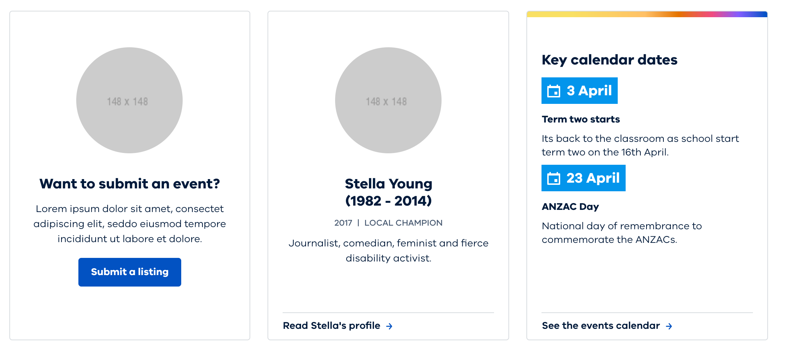

# Fields and components

This section describes how Tide Drupal profile and modules use and re-use fields
within content types and other entities such as paragraphs and taxonomy terms.

## Concepts
1. Fields are re-used between system components as much as possible.
2. Fields names are kept to the minimum length.
3. Fields always have a prefix that describes the entity or the feature they 
   belong to.  
   For example: `field_page_intro_text` is a _Introductory text_ for _Page_ content 
   type. 
4. Fields configuration is bundled within Tide modules.   
5. Some fields are programmatically created when specific Tide modules are 
   installed (for example, Tide Site creates 2 fields for each content type). 
  
## Kinds of fields

- Content fields - used to capture and store content that is later exposed 
  through API and consumed by the front-end. 
  For example, `Body` or `Summary` fields. 
- Flag (on/off) fields - used to enable/disable rendering of a pre-defined 
  component / block / feature in Frontend Websites. 
  For example, `Show social links` field that tells Frontend Website to show 
  or hide `Social links` component (which exists only in Frontend Website).   
- Reference fields - used to reference other content items. These are rendered
  in API as references; API consumers are expected to use `?include` JSONAPI
  standard mechanism to include the contents of the referenced entity into the 
  API response.   
  For example, _Cards_ components are _paragraphs_ referenced from within the
  content type. Frontend Website must include paragraph name to retrieve required
  paragraph content.

## Cards

Cards are front-end components that are implemented as _paragraph items_ in 
Tide.

- Cards implemented as Paragraphs
- Cards are reusing fields storage (see the list of fields below).

??? "List of Card fields"
    
    | Name | Machine name | Type |
    | --- | --- | --- |      
    | Title | `field_paragraph_title` |  Text field |
    | Summary | `field_paragraph_summary` |  Large multiline text field with WYSIWYG support |
    | Author | `field_paragraph_author` |  Text field |
    | Media | `field_paragraph_media` |  Media field |
    | Date  | `field_paragraph_date` |  Date field |
    | Link | `field_paragraph_link` |  Link field |
    | List | `field_paragraph_list` |  Entity reference |
    | Location | `field_paragraph_location` |  Location/ |Addressfield
    | Reference | `field_paragraph_reference` |  Entity reference |
    | Topic | `field_paragraph_topic` |  Entity reference |
- Cards have 1-to-1 mapping to paragraphs. This means that:
    - cards can be added/removed from/to Frontend Websites and have 
      their _paragraphs_ counterparts added/removed in Content Repository
    - mandatory state of the fields on cards is easier to configure and manage
    - there is no need to manage any other 'types' of the same card (i.e. no 
      special fields that would modify the 'type' of the card making it appear 
      differently)
- _Automated cards_ are using list entity reference field to reference items.

??? info "About Automated cards"
    
    Automated cards are cards that source their content from a pre-defined 
    mapping in the Content API. For example, a card with a list of latest 3 
    events that automatically fetches only 3 latest events.  
    
    Note that fetching the page with the information about the card does not 
    fetch the contents of the card; Frontend Website must perform an additional 
    request to get this data.
   

- Listing cards are comprised of paragraphs, resulting in nesting paragraphs 
  (for example, _Key Dates_ paragraph will have a list of _Event_ paragraphs).

### Cards and paragraphs

The table below describes how every _Card_ component is represented with Tide
_paragraphs_. 

|Card |Label (in Drupal)|Machine name|Fields (label, machine name)|Comments|
|--- |--- |--- |--- |--- |
|Navigation featured (Manual)     |Navigation featured            |`card_navigation_featured`       |Title - `field_paragraph_title` Summary - `field_paragraph_summary` Image - `field_paragraph_media` Link - `field_paragraph_link`|This card has 1 text link. Link text = Title|
|Navigation featured (Automatic)  |Navigation featured Automated  |`card_navigation_featured_auto`  |Referred content - `field_paragraph_reference`|This card has 1 text link. Link text = Title|
|Navigation (Manual)              |Navigation                     |`card_navigation`                |Title - `field_paragraph_title` Summary - `field_paragraph_summary` Link - `field_paragraph_link`|This card has 1 text link. Link text = Title|
|Navigation Automated             |Navigation Automated           |`card_navigation_auto`           |Referred content - `field_paragraph_reference` |This card has 1 text link. Link text = Title|
|Promotion (Manual)               |Promotion                      |`card_promotion`                 |Title - field_paragraph_title Summary - `field_paragraph_summary` Image - `field_paragraph_media` Date - `field_paragraph_date` Topic - `field_paragraph_topic` Link - `field_paragraph_link`|This card has 3 text links.  Link 1 = Title Link 2 = Topic Link 3 = Link|
|Promotion Automated              |Promotion Automated            |`card_promotion_auto`            |Referred content - `field_paragraph_reference` |This card has 3 text links. Link 1 = Title Link 2 = Topic Link 3 = Link|
|Event (Manual)                   |Event                          |`card_event`                     |Title - `field_paragraph_title` Summary - `field_paragraph_summary` Image - `field_paragraph_media` Date - `field_paragraph_date` Location - `field_paragraph_location` Topic - `field_paragraph_topic` Link - `field_paragraph_link` |This card has 4 text links.   Link 1 = Title Link 2 = Location Link 3 = Topic Link 4 = Link|
|Key dates (Manual)               |Key dates                      |`card_keydates`                  |1. Add a paragraph type `Keydates` (with fields): Key Dates - `field_paragraph_keydate` Title - `field_paragraph_title` Summary - `field_paragraph_summary` Link - `field_paragraph_link` 2. Add a paragraph type - `Card Keydates` Keydates - Entity Ref - Paragraph type created above - Max 2 values CTA - `field_paragraph_cta` |This card has 3 text links. Link 1 = Link (Keydates 1) Link 2 = Link (Keydates 2) Link 3 = CTA|
