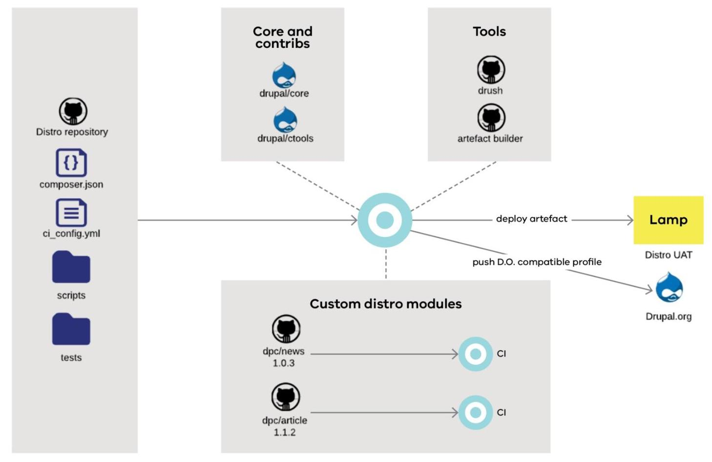

# Tide

Tide is an API first, headless content management system using Drupal 8 and 
maintained by SDP. 

Custom built to meet Victorian Government requirements, it offers:

- multi-site content distribution
- pick and mix features
- centralised feature governance

The profile is a mere collection of Tide modules bundled into governed,
stable and tested Drupal installation profile.

All modules and a profile have automated tests to guarantee that a set of all
modules at specified versions is always stable. 

## Namespaces
- Composer vendor namespace: `dpc-sdp`
- Composer Drupal profile namespace: `dpc-sdp/tide`
- Composer Drupal modules namespace: `tide_*`.
- Drupal.org Drupal profile namespace: `tide`.
- Drupal.org Drupal modules namespace: `tide_*`.
- Drupal profile machine name: `tide`  
- Drupal modules machine name: `tide_*`  

## Repositories
- Drupal profile: https://github.com/dpc-sdp/tide
- Drupal custom modules: 
    - https://github.com/dpc-sdp/tide_api         
    - https://github.com/dpc-sdp/tide_core        
    - https://github.com/dpc-sdp/tide_event       
    - https://github.com/dpc-sdp/tide_landing_page
    - https://github.com/dpc-sdp/tide_media       
    - https://github.com/dpc-sdp/tide_monsido     
    - https://github.com/dpc-sdp/tide_news        
    - https://github.com/dpc-sdp/tide_page        
    - https://github.com/dpc-sdp/tide_search      
    - https://github.com/dpc-sdp/tide_site        
    - https://github.com/dpc-sdp/tide_test        
    - https://github.com/dpc-sdp/tide_webform     

See [Modules](modules.md) chapter for more information about modules.
