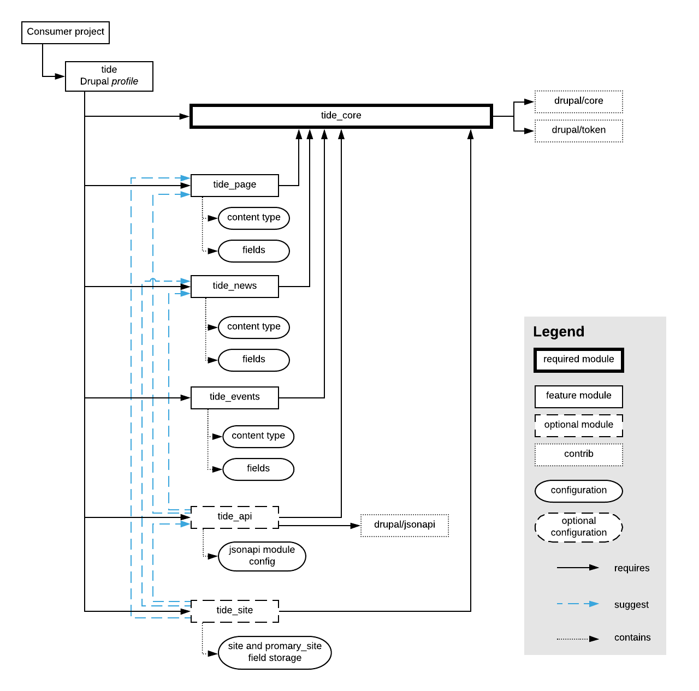

# Modules

The standalone modules are split based on the features or functionality they 
provide. Modules can be installed as a part of the profile as well as a 
standalone (provided that other dependency modules installed as well).
 
- Every module implements a well-defined feature set.  
- Modules are versioned.<br/>
  This allows for more granular approach when picking modules for particular 
  site needs.
- Every module has a minimal dependency on other modules. 
- Every module has a set of relevant automated tests.  

## List of modules

| Name              | Machine name      | Category              | Repository                                   | Description                                                                                                   | 
|-------------------|-------------------|-----------------------|----------------------------------------------|---------------------------------------------------------------------------------------------------------------| 
| Tide API          | tide_api          | Utility               | https://github.com/dpc-sdp/tide_api          | Exposes content entities to API endpoints. it is required for sites running headless.                         | 
| Tide Core         | tide_core         | Utility               | https://github.com/dpc-sdp/tide_core         | Configurations and settings for Tide distribution. Dependency module for any other Tide module.               | 
| Tide Event        | tide_event        | Content type          | https://github.com/dpc-sdp/tide_event        | Event content type and fields.                                                                                | 
| Tide Landing Page | tide_landing_page | Content type          | https://github.com/dpc-sdp/tide_landing_page | "Landing page content type with fields. Based on paragrpahs, it allows to create pages with complex layouts." | 
| Tide Media        | tide_media        | Utility               | https://github.com/dpc-sdp/tide_media        | Media types and configurations.                                                                               | 
| Tide Monsido      | tide_monsido      | 3rd party integration | https://github.com/dpc-sdp/tide_monsido      | Integration with Monsido platform.                                                                            | 
| Tide News         | tide_news         | Content type          | https://github.com/dpc-sdp/tide_news         | Event content type and fields.                                                                                | 
| Tide Page         | tide_page         | Content type          | https://github.com/dpc-sdp/tide_page         | Page content type and fields.                                                                                 | 
| Tide Search       | tide_search       | Utility               | https://github.com/dpc-sdp/tide_search       | Search configurations and settings.                                                                           | 
| Tide Site         | tide_site         | Utility               | https://github.com/dpc-sdp/tide_site         | Multi-site and multi-section content sharing.                                                                 | 
| Tide Test         | tide_test         | Utility               | https://github.com/dpc-sdp/tide_test         | Test content type and helpers used to test other modules.                                                     | 
| Tide Webform      | tide_webform      | Utility               | https://github.com/dpc-sdp/tide_webform      | Forms supports such as Content Rating form.                                                                   |  

## Tide Profile vs Tide Core module
In order to allow using of Tide modules outside of profile, it was decided to 
use Drupal profile `tide` only as a collection of `tide_*` modules (required in 
profile's `composer.json` and profiles info yml file as dependency), while all 
of the common site configuration is captured in the `tide_core` module, making
it a main dependency for all other modules. 

??? "Diagram of Tide module dependency"

     

## Versions
Modules versions follow [semantic versioning](https://semver.org/):

!!! quote
    
    Given a version number `MAJOR.MINOR.PATCH`, increment the:<br/>
    `MAJOR` version when you make incompatible API changes,<br/>
    `MINOR` version when you add functionality in a backwards-compatible 
    manner, and<br/>
    `PATCH` version when you make backwards-compatible bug fixes.<br/>
    
    Additional labels for pre-release and build metadata are available as 
    extensions to the `MAJOR.MINOR.PATCH` format.

With some Tide functionality heavily relying on specific Drupal core 
version, when features added and changed in `MINOR` Drupal core 
versions (like moving Media into Drupal core), Tide modules increment 
their `MAJOR` version when Drupal core or dependent contributed modules change 
their API.

Since Tide modules functionality is built on top of Drupal core and contributed 
modules, it has to "tighten" versioning rules.

Every Tide module has to increment the:

- `MAJOR` version when Drupal core or contrib module has an API change. An 
  example of this is moving Media into Drupal core in version `8.5`.
- `MINOR` version when Tide module functionality is enhanced or when other 
  dependent Tide module has it's API change (that would trigger own release).   
- `PATCH` version when there is a backwards-compatible bug fixes (no change 
  from SemVer).

It is important to understand that a module's `MAJOR` version must be
incremented if it's API has changed, since other modules now have to update
their integrations with current module to use a new version.

### Example of version increments   

Consider this module dependency tree:
```
|-consumer site
  |-tide@1.1.1
    |- tide_page@2.2.2
    | |- tide_core@3.3.3
    |    |- drupal@8.5.6 
    |- tide_api@4.4.4
      |- jsonapi@1.2.0
```

Consumer site requires Tide profile, which is normal practice to solely rely on 
upstream maintenance and receive updates. 

Tide profile requires Tide page, which relies on Tide Core, and Tide API. Note
that Tide Page has some optional API configuration that is used only when Tide 
API is enabled.  

!!!note

    Since `tide_core` is a module with most profile configuration, it
    also has Drupal versions constraint.
    
When Tide Page adds a new field, it changes it's "contract" with other modules, 
making it's `MAJOR` version to increment, resulting in version `4.0.0`. However, 
the `tide` profile that was referencing the `tide_page` module at `2.2.2` has 
not changed it's own "contract", making the release a `MINOR` change, resulting 
in version `1.2.0`.

Another case - dependency is updated. When `tide_api` updates integration with
`jsonapi` from `1.2.0` to `2.0.0`, the `MAJOR` version of `tide_api` must be
incremented as well, since `jsonapi@2.0.0` brings configuration changes
incompatible with version `1.*`. Now, `tide_page` has optional configuration for
`jsonapi` module, which now has to be updated, so `tide_page` `MINOR` version is
updated from `2.2.2` to `2.3.0`. This is because `tide_page` does not change
it's own "contract" with other modules - the fields are the same, the output of
API requests is the same, other functionality provided by `tide_api` is the same
as before, but just internal implementation was changed.

Last example - updating Drupal core to `8.6.12`, which releases API changes within it's 
`MINOR` versions. This is a special case for versioning of the Tide module - 
`tide_core` has to increment it's `MAJOR` version. 

The resulting dependency tree would look like this:

```
|-consumer site
  |-tide@1.2.0            <-- MINOR version updated
    |- tide_page@2.3.0    <-- MINOR version updated
    | |- tide_core@4.0.0  <-- MAJOR version updated
    |    |- drupal@8.6.12 <-- MINOR version updated 
    |- tide_api@5.0.0     <-- MAJOR version updated
      |- jsonapi@2.0.0    <-- MAJOR version updated
```

## Automated testing

Tide modules use PHPUnit and Behat for unit and integration/behavioural 
testing. The tests are running inside of the Continuous Integration pipeline 
provided by [CircleCI](https://circleci.com). 

For every change pushed to the repository, CircleCI starts the build, where 
tests are running in 2 modes: `normal` and `suggested`. 

In `normal` mode the module is installed with it's required dependencies into
freshly built Drupal site. Once installed, the tests will run and check that 
the configuration shipped with the module indeed works.

In `suggested` mode, the module is installed with it's requires and **optional**
dependencies. Once installed, the tests will run and check that the
configuration shipped with the module indeed works and that **it does not
conflict with other optional modules**.

This "double-testing" is very powerful tool to keep configuration in 
releasable state. Without it, there is a high chance of committing conflicting
configurations into multiple modules, releasing modules without knowing about
this problem, and becoming to a "stale mate" situation, where Content Repository
implementation site needs to be updated, but there are no modules that can be 
installed without breaking configuration.  

## Maintenance 
SDP development team is committed to support development, maintain all 
Tide modules and follow versioning rules.

## Developing modules
See [Module development](../../development/content-repository/module-development) chapter.
