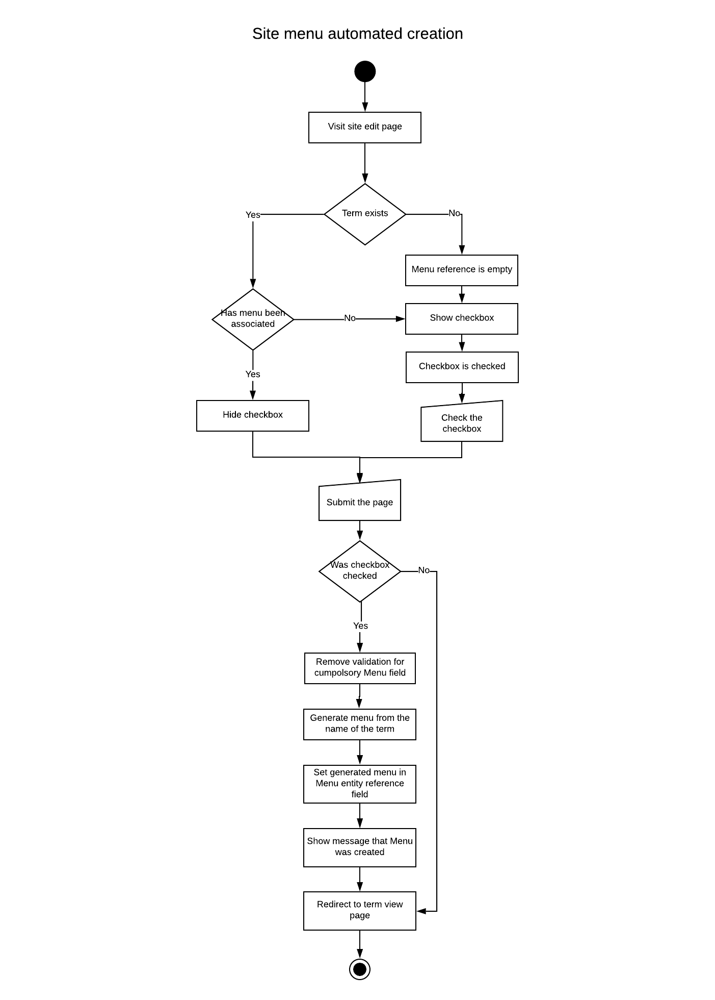
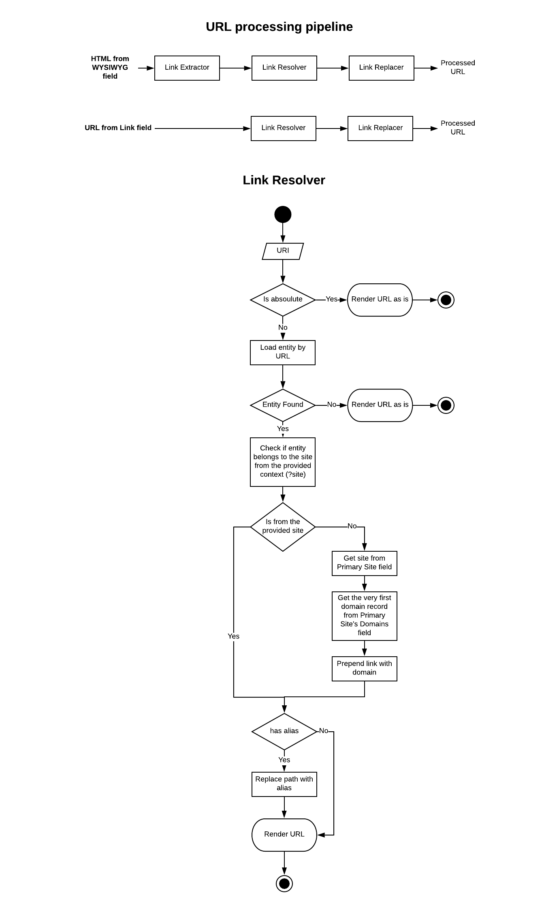

# Sites and sections

Content Repository supports multi-site and multi-section content publishing.
This means that a content piece may be re-used several times on multiple _sites_
and _sections_ (_sections_ belong to _sites_).

[Tide Site](https://github.com/dpc-sdp/tide_site) module provides an ability for
Editor to publish content to selected _sites_ and _sections_.

## How it works

_Sites_ and _sections_ defined in a single vocabulary `Sites` with the maximum
depth of 1, making root-level terms to become _sites_ and terms of depth level 1
to become _sections_. The module has code to provide back-end validation to
prevent creating of terms with depth more than 1.
    
We decided to use Drupal taxonomy for sites and sections for multiple
reasons: 

- Taxonomy terms are fieldable entities. This means that Frontend Websites can
extend per-site properties as required, exposing them to the API.
- Taxonomy terms support hierarchy, which helps to define site-section
relationship, and, as a result of this, easily filter associated content by 
site.
- Taxonomy terms can be selected in UI using one of the existing contributed 
widgets.
- Taxonomy terms have full Token and Pathauto support, which makes it easy 
to use them for building content URLs based on IA.
- Taxonomy terms have full JSONAPI support and can be queried by Frontend 
  Websites in the same way as any other entities.
- The concept of using taxonomy terms to group content is easy to understand.
- The concept of using taxonomy terms to store per-site settings is easy to understand. 

Content may be shared between sites, but never between sections, as this would
lead to the same content being served from different URLs, which is highly
discouraged by search engines. 

### Primary site
To mitigate the problem when the same content is shared between different
websites, a selection of `Primary site` is required, which will be used to
generate canonical URL for the content piece. As a result, every content type
has 2 fields created automatically: `site` and `primary_site`. Both fields are
compulsory. Editors are expected to select destination site and section for each
content piece.

## Site and Section Fields 

To provide site and section-specific information through API, every `Site` 
taxonomy term has a set of the following information fields:

| Field | Description |
|---|---|
| Domains | Multiline plain text field to specify site domains. This is used by Ripple to match on the domain where the request is coming from. One domain per line. Wildcards supported. |
| Title | Text field to specify site title. |
| Slogan | Text field to specify site slogan. |
| Logo | File field to upload site logo. |
| Footer message | Text field with WYSIWYG support to specify site footer message. |
| Main Menu | Per-site and per-section menus may be helpful to build section-based navigation experience.     Site admins may associate existing or create new menu with every site term.     This is an entity reference field. |
| Footer Menu | Per-site and per-section menus may be helpful to build section-based navigation experience.     Site admins may associate existing or create new menu with every site term.     This is an entity reference field. |

!!! note
    
    Since Frontend Websites information is stored using fieldsable taxonomy terms,
    it is possible to add more fields to capture site information in the Content
    Repository. The data stored in these fields will become automatically 
    exposed through API.  

## Site menus
Per-site and per-section menus may be helpful to build section-based navigation 
experience. They allow to provide custom menu items for specific sites and 
sections.  

Site menus automatically created when a new `Site` taxonomy term is created. 

Basically, instead of creating a site and then manually creating a
menu on the separate screen, we automatically create and assign a menu
for each site within the site creation screen by checking relevant checkbox
on `Site` term ctreation page.
 
??? note "Expand for Site menu creation flow diagram"
    

## Multi-site URL rendering

When content piece belongs to multiple sites or sections, it may have links to
it from other content pieces of the current domain or other domains. Drupal has
to render these links with correct domains as a part of url, so that Frontend
Websites could output these links as-is.

!!! info "Example of multi-site URL rendering"

    For example, if we have:
    
    - 2 sites `first.com` and `second.com` 
    - 2 pages `page1` and `page2`
    - `page1` has a link to `page2`
    - `page1` belongs to `first.com`
    - `page2` belongs to both `first.com` and `second.com`; the _primary site_ 
      is set to `second.com`
     
    When the visitor is on the page `first.com/page1` and follows the link `/page2`
    she should end up on `first.com/page2` and not `second.com/page2`. This is
    because she is currently on `first.com` domain and _continues_ browsing the 
    same domain. 
    
    And if the visitor comes from Google search to `page2`, she should end up at
    `second.com/page2`, because `second.com` is a _primary site_ for `page2`.

This is just an example of the part of the problem. There are more use-cases and
they are explained below. 

For content exposed through API, the links may come from different places and we
need to be able to extract internal entity id:

- For link fields, this should be fairly straightforward: the user enters the
link and we have an internal entity id. 
- For links entered in WYSIWYG, we need to use the LinkIt module so that we 
can extract an internal entity id.
- For links entered in WYSIWYG within referenced entities (for example, field on
the paragraph belonging to the page) the API output will contains the path alias.

For all links presented to the user: 

- Internal links should be rendered as a relative path. If the link is to a page
available on the current site, either primary or not, render as a relative link.
- External links (including links to other sites/section) should be rendered
with an absolute path.

For links within WYSIWYG, Drupal has to extract, analyse and replace links
before rendering it through API. For this, we use an enhancer (special piece of
code to manipulate content output before it is rendered through API) to scrape
the content, then render the relevant link.

??? "Implementation details"
    
    The content is extracted from the raw contents of WYSIWYG filed using 
    _Link Extractor_. 
    
    _Link Extractor_ scans HTML and extracts all links. This happens before 
    Drupal sanitizes WYSIWYG field output. Every extracted link is then passed 
    to a _Link Resolver_.
    
    _Link Resolver_ takes node id, loads up the path alias using some complex 
    logic (see diagram below) and then swaps it within the `href`. Resolved URL 
    is then passed to _Link Replacer_.
    
    _Link Replacer_ replaces old extracted links with new resolved ones within 
    contents of the WYSIWYG field. The processsed field contents is then passed
    to API for normal rendering as JSONAPI response. 
    
    For links coming from Link fields, the above applies, but starting from 
    _Link Resolver_ (there is no HTML to extarct teh link from , so 
    _Link Extractor_ is not required).
      
    The following diagram describes URL processing and link resolution in 
    detail.
     
    
