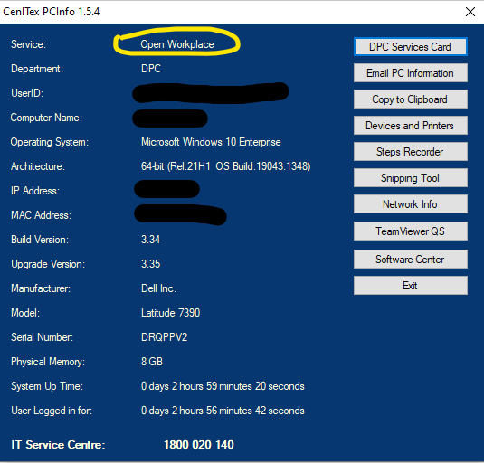

# Troubleshooting

!!! info
    
    You are viewing a version of the documentation that is currently under 
    active development.

 This page provides some workarounds for issues that you may encounter during a local build.

## Open Workspace | Cenitex | Citrix
Unable to install software (e.g Docker Desktop) or run commands which require elevated permissions.

1. Check if you Open Workspace is installed on your machine. This will allow software installation that requires elevated permissions.
2. If you believe Open Workspace is installed but are still having issue with installations, logoff from Citrix Gateway (Windows Taskbar Icon) and reconnect through Go Connect (Window search). An IE browser will open and ask for your DPC login credentials. Process might take some time to complete or your browser might appear to hang. In that case try restarting your computer and retry Go Connect again.
3. Check again to see if you have the elevated permissions or not. You might have to restart your computer several times for it it to take effect.



## Lagoon | Lagoon CLI
*(Remote work)* Unable to resolve host or cannot decrypt encoded SSH

- Check if ssh-agent is running: ``` eval `ssh-agent` ```
- Sometimes /etc/resolv.conf might have changed. You will have to set nameserver to your internet default gateway.
- Create if haven't both *id_rsa* and *id_rsa.pub* from copying your newly under your *.ssh* folder. Now, run command `ssh-add` for both id_rsa and your id_\<yoursshid\>

## Pygmy-Go 
- 15 October 2021 [*(v0.7.1)*](https://github.com/fubarhouse/pygmy-go/releases/latest): There was an [issue #312](https://github.com/fubarhouse/pygmy-go/issues/312) with SSH keys trying to add keys with passphrase and returned *"The agent has no identities."*. Workaround is to create another SSH without passphrase and re-add the keys. After solving pygmy-go and ssh keys issues, do another build with the following sequence:
    1. restart pygmy
    2. restart docker
    3. restart build

- This site can't be reached error. It is a Cenitex related issue as it hogs port 80.
    - Configure .pygmy.yml to use different ports.
        ```
            PortBindings:
                <port_number>/tcp:
                - HostPort: <port_number>
        ```
    - Example:
        ```
        services:
        amazeeio-haproxy:
            Config:
            Image: fubarhouse/amazeeio-haproxy-8080
            HostConfig:
            PortBindings:
                8080/tcp:
                - HostPort: 8080
                443/tcp:
                - HostPort: 443
        ```
- Error 404
    - Change to use https
    

## Docker | Ahoy
- *=> ERROR [reference-sdp-vic-gov-au_nginx internal] load metadata for ...* ```ahoy build``` destroys all containers and rebuilds from scratch and ```ahoy up``` starts existing containers. 
    - From Docker dashboard, go to Setting -> Docker Engine and look for the key "buildkit". Change the value to false.


## Others
- resolv.conf may changed the nameserver unexpectedly several times during build. To stop it from changing, create a wsl.conf and insert the following:
    ```
        [network]
        generateResolvConf = false
    ```